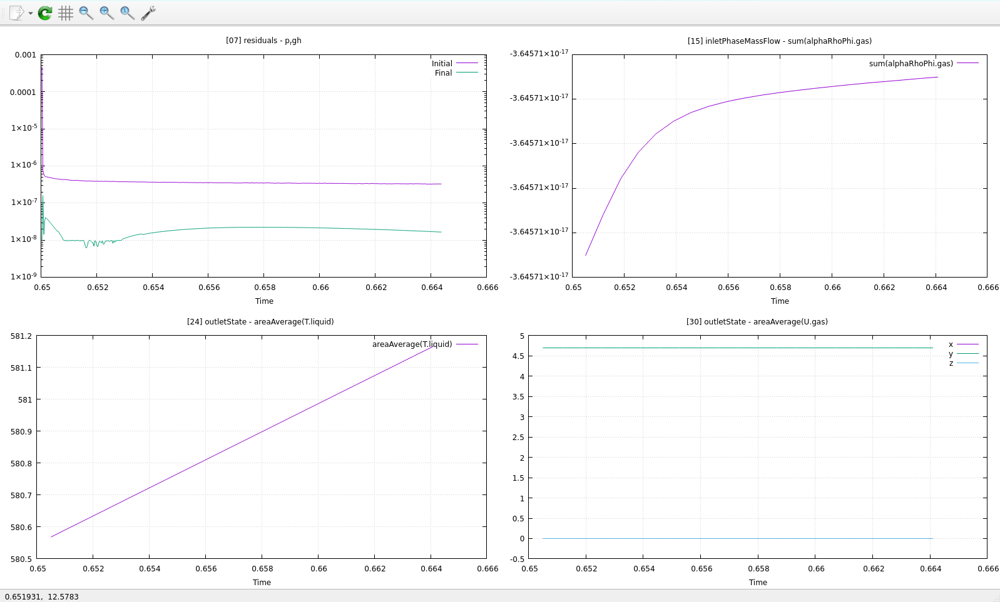

# OFGS (OpenFOAM Gnuplot Suite) v2.3.0

OFGS (OpenFOAM Gnuplot Suite) is a standalone command-line tool built around gnuplot for visualising OpenFOAM simulation data. It automatically detects supported datasets and provides commands for generating, viewing and live-monitoring simulation graphs.

<!-- <p align="center"> -->
  
<!-- </p> -->

## Prerequisites

OFGS requires:

- GNUPlot 5.4 or later
- Python 3
- An OpenFOAM case containing supported post-processing data

Tested on:
- HPC Environments
- Windows Subsystem for Linux (WSL)

## Installation

### Package repositories (recommended)

OFGS supports Debian 12 and Rocky Linux 9. Repository setup is required only once.

```bash
curl -fsSL https://munzirahmed.dev/install-ofgs | sudo bash
```
### Source installation

Download or clone the repository and change into the OFGS directory:

```bash
cd /path-to/ofgs
```

Install OFGS system-wide:

```bash
sudo ./install.sh
```

Rerunning the installer updates an existing OFGS installation after confirmation. Use `--force` to skip the prompt.

To remove OFGS:

```bash
sudo ./uninstall.sh
```

## Usage

Generate all gnuplot scripts for the current OpenFOAM case:

```bash
ofgs generate
```

Open the interactive monitoring dashboard:

```bash
ofgs monitor
```

Open the monitoring dashboard with automatic updates every two seconds:

```bash
ofgs monitor --live
```

List all available graphs:

```bash
ofgs list
```

Open a specific graph by ID:

**(Separate multiple graph id's with commas)**

```bash
ofgs graph <id>
ofgs graph <id1,id2,...>
```

Open a graph with automatic updates:
```bash
ofgs graph <id> --live
```

Display the built-in help message:

```bash
ofgs help
ofgs help <command>
```

Remove the generated dashboard and standalone graph files from the current directory:

```bash
ofgs clean
```

This removes only `monitor.gp` and `graphs/`, after confirmation. Use `--force` to skip the prompt. OpenFOAM case data is never removed.

Diagnose the OFGS installation, system dependencies, current OpenFOAM case, generated dashboard and supported datasets:

```bash
ofgs doctor
```

Doctor is read-only and never generates graphs or modifies files.

## Recommended Usage

OFGS is built on top of gnuplot and therefore inherits some of its display and formatting limitations.

For cases with a large number of available graphs, `ofgs monitor` provides a useful overview of the simulation. However, displaying many graphs in a single window can make individual plots difficult to read. This all depends on the amount of graphs generated and the size of your monitor.

For a more detailed view, use `ofgs list` to see the available graph IDs and select only the graphs you are interested in viewing.

`ofgs monitor --live` is best suited to getting an overview of the entire simulation while it is running, while viewing selected graphs individually or in smaller groups is recommended for a clearer and more focused view of specific results and trends.

## Shared HPC Cases

OFGS respects the existing Unix permissions of the OpenFOAM case.

For collaborative cases, ensure the case uses an appropriate shared group with setgid/default ACLs and a cooperative umask such as `0002`. OFGS does not modify the ownership or permissions of OpenFOAM simulation data.

## Notes

- Run commands from the root directory of an OpenFOAM case.
- All viewing commands automatically regenerate the required graph scripts before opening them, ensuring the latest simulation data is displayed.
- `ofgs generate` can be used when you only want to regenerate the dashboard and graph scripts without opening a window.
- Live mode refreshes graphs automatically every two seconds while a simulation is running.
